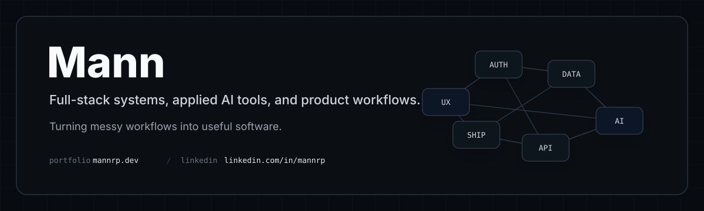
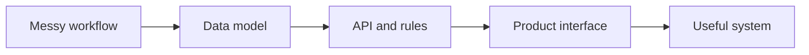

Software engineer building full-stack systems, applied AI tools, and product-focused workflows.

I like turning messy workflows into clear data models, useful APIs, and interfaces that people can actually use.

---

## Selected Work

<table>
  <tr>
    <td width="50%" valign="top">
      <h3><a href="https://github.com/mannrp/quorum">Quorum</a></h3>
      
Capstone and project matching platform for students, teams, project owners, and admins.

      
<strong>Includes:</strong> student profiles, team creation, join requests, invitations, project listings, admin approval, applications, offers, messaging, notifications, audit logs, and signed uploads.

      
<strong>Stack:</strong> Next.js, React, Tailwind, Neon Auth, Go, gqlgen GraphQL, Postgres, Cloudflare R2, Turborepo.

    </td>
    <td width="50%" valign="top">
      <h3><a href="https://github.com/mannrp/GhostArc">GhostArc</a></h3>
      
Voice-assisted system design canvas for describing architecture changes, reviewing staged model actions, and applying or rejecting them before the diagram changes.

      
<strong>Includes:</strong> React Flow canvas, typed and voice commands, Gemini-backed structured actions, staged edits, Prisma persistence, SQLite, PNG export, and automated tests.

      
<strong>Stack:</strong> Next.js, React, TypeScript, React Flow, Zustand, Prisma, SQLite, Gemini, Playwright, Vitest.

    </td>
  </tr>
  <tr>
    <td width="50%" valign="top">
      <h3><a href="https://github.com/mannrp/ferrous">Ferrous</a></h3>
      
High-performance RAG primitives for Python, written in Rust.

      
<strong>Includes:</strong> fuzzy caching with SimHash, structure-aware Markdown chunking, token-accurate splitting for OpenAI and HuggingFace tokenizers, TextRank context packing, and U-shaped ordering for long-context retrieval.

      
<strong>Stack:</strong> Rust, Python bindings, SQLite, tiktoken-rs, HuggingFace tokenizer support.

    </td>
    <td width="50%" valign="top">
      <h3><a href="https://github.com/mannrp/saybon">SayBon</a></h3>
      
Progressive web app for learning French with AI-powered exercises and instant feedback.

      
<strong>Includes:</strong> CEFR A1-C2 practice, conjugation, translation, vocabulary, grammar exercises, typo-tolerant validation, English explanations, BYOK Gemini configuration, and local IndexedDB storage.

      
<strong>Stack:</strong> React, TypeScript, Vite, Tailwind CSS, IndexedDB, Google Gemini.

    </td>
  </tr>
</table>

## More Builds

| Project | What it proves | Stack |
|---|---|---|
| [WorkSwap](https://github.com/mannrp/workswap) | Shift management, swap requests, offers, departments, JWT auth, service-layer backend design, integration tests. | ASP.NET Core, EF Core, SQLite, JWT, xUnit |
| [Underleaf](https://github.com/mannrp/underleaf) | Local LaTeX editor with live PDF preview, Monaco editor, resizable panes, and desktop packaging. | Electron, React, TypeScript, Monaco, Zustand, Tailwind, Vite |

## How I Think About Systems

## Stack

| Area | Tools |
|---|---|
| Languages | TypeScript, JavaScript, Go, Rust, Python, C#, SQL |
| Frontend | React, Next.js, Vite, Tailwind CSS, React Flow, Electron |
| Backend | Go GraphQL APIs, Next.js route handlers, ASP.NET Core, Prisma, Entity Framework Core |
| Data | Postgres, SQLite, IndexedDB, Cloudflare R2 |
| AI and retrieval | Gemini, RAG utilities, token-aware chunking, context packing, fuzzy caching |
| Testing and tooling | Playwright, Vitest, xUnit, Turborepo, Docker |

## Current Focus

- Full-stack product workflows with auth, messaging, approvals, and admin review.
- Applied AI interfaces where model output is staged, inspectable, and reversible.
- Retrieval and document-processing primitives that make AI systems faster and more predictable.

## Links

[GitHub](https://github.com/mannrp)
