  
  &nbsp;
  

## Selected Work

<table>
  <tr>
    <td width="50%" valign="top">
      <h3><a href="https://github.com/mannrp/quorum">Quorum</a></h3>
      
Capstone and project matching platform for students, teams, project owners, and admins.

      
<strong>Includes:</strong> student profiles, team creation, join requests, invitations, project listings, admin approval, applications, offers, messaging, notifications, audit logs, and signed uploads.

      
<strong>Stack:</strong> Next.js, React, Tailwind, Neon Auth, Go, gqlgen GraphQL, Postgres, Cloudflare R2, Turborepo.

    </td>
    <td width="50%" valign="top">
      <h3><a href="https://github.com/mannrp/GhostArc">GhostArc</a></h3>
      
Voice-assisted system design canvas for describing architecture changes, reviewing staged model actions, and applying or rejecting them before the diagram changes.

      
<strong>Includes:</strong> React Flow canvas, typed and voice commands, Gemini-backed structured actions, staged edits, Prisma persistence, SQLite, PNG export, and automated tests.

      
<strong>Stack:</strong> Next.js, React, TypeScript, React Flow, Zustand, Prisma, SQLite, Gemini, Playwright, Vitest.

    </td>
  </tr>
  <tr>
    <td width="50%" valign="top">
      <h3><a href="https://github.com/mannrp/workswap">WorkSwap</a></h3>
      
Shift management and swap system for teams managing schedules, shift swaps, and open shift offers.

      
<strong>Includes:</strong> registration, login, JWT authorization, departments, shift CRUD, swap requests, shift offers, notifications, health checks, service-layer architecture, and integration tests.

      
<strong>Stack:</strong> ASP.NET Core, Entity Framework Core, SQLite, ASP.NET Identity, JWT, xUnit, Scalar.

    </td>
    <td width="50%" valign="top">
      <h3><a href="https://github.com/mannrp/saybon">SayBon</a></h3>
      
Progressive web app for learning French with AI-powered exercises and instant feedback.

      
<strong>Includes:</strong> CEFR A1-C2 practice, conjugation, translation, vocabulary, grammar exercises, typo-tolerant validation, English explanations, BYOK Gemini configuration, and local IndexedDB storage.

      
<strong>Stack:</strong> React, TypeScript, Vite, Tailwind CSS, IndexedDB, Google Gemini.

    </td>
  </tr>
</table>

## More Builds

| Project | What it proves | Stack |
|---|---|---|
| [Ferrous](https://github.com/mannrp/ferrous) | High-performance RAG primitives, fuzzy caching, token-aware Markdown chunking, TextRank context packing, and Rust-backed Python utilities. | Rust, Python, SQLite, tiktoken-rs |
| [Underleaf](https://github.com/mannrp/underleaf) | Local LaTeX editor with live PDF preview, Monaco editor, resizable panes, and desktop packaging. | Electron, React, TypeScript, Monaco, Zustand, Tailwind, Vite |

## Languages / Skills / Tools

<table>
  <tr>
    <td width="33%" valign="top">
      <h3>Languages</h3>
      

        <code>TypeScript</code> <code>JavaScript</code> <code>Go</code> 
        <code>Rust</code> <code>Python</code> <code>C#</code> <code>SQL</code>
      

    </td>
    <td width="33%" valign="top">
      <h3>Product Skills</h3>
      

        <code>Auth</code> <code>Messaging</code> <code>Approvals</code> 
        <code>Admin flows</code> <code>Dashboards</code> <code>Realtime UX</code>
      

    </td>
    <td width="33%" valign="top">
      <h3>Tools</h3>
      

        <code>React</code> <code>Next.js</code> <code>Tailwind</code> 
        <code>Postgres</code> <code>SQLite</code> <code>Docker</code> <code>Playwright</code>
      

    </td>
  </tr>
  <tr>
    <td width="33%" valign="top">
      <h3>Backend</h3>
      

        <code>GraphQL</code> <code>REST APIs</code> <code>gqlgen</code> 
        <code>ASP.NET Core</code> <code>Prisma</code> <code>EF Core</code>
      

    </td>
    <td width="33%" valign="top">
      <h3>AI Systems</h3>
      

        <code>Gemini</code> <code>RAG</code> <code>Voice input</code> 
        <code>Staged actions</code> <code>Chunking</code> <code>Context packing</code>
      

    </td>
    <td width="33%" valign="top">
      <h3>Testing</h3>
      

        <code>Vitest</code> <code>xUnit</code> <code>Playwright</code> 
        <code>Integration tests</code> <code>CI builds</code>
      

    </td>
  </tr>
</table>

## Currently Working On

- Converting SayBon into a React Native, offline-first French learning app.
- Refactoring existing repos with cleaner structure, stronger tests, and sharper READMEs.
- Building Quorum into a fuller capstone/project matching workflow for students, teams, project owners, and admins.

## Links

  <a href="https://mannrp.dev"><strong>Portfolio: mannrp.dev</strong></a>
  &nbsp;&nbsp;|&nbsp;&nbsp;
  <a href="https://linkedin.com/in/mannrp"><strong>LinkedIn: /in/mannrp</strong></a>
  &nbsp;&nbsp;|&nbsp;&nbsp;
  <a href="https://github.com/mannrp"><strong>GitHub</strong></a>

